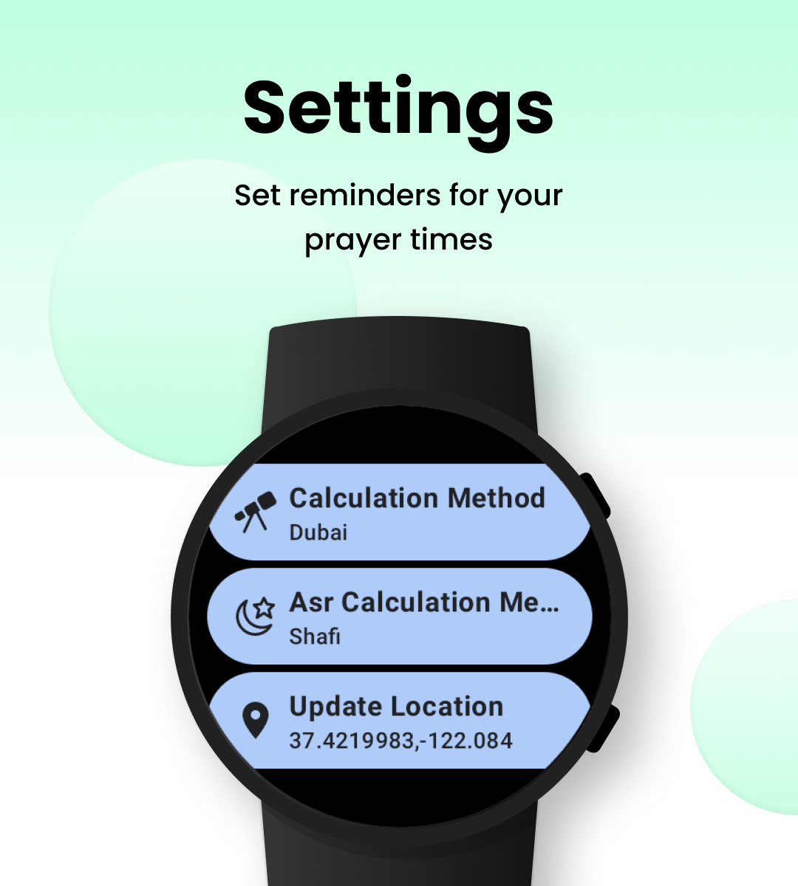
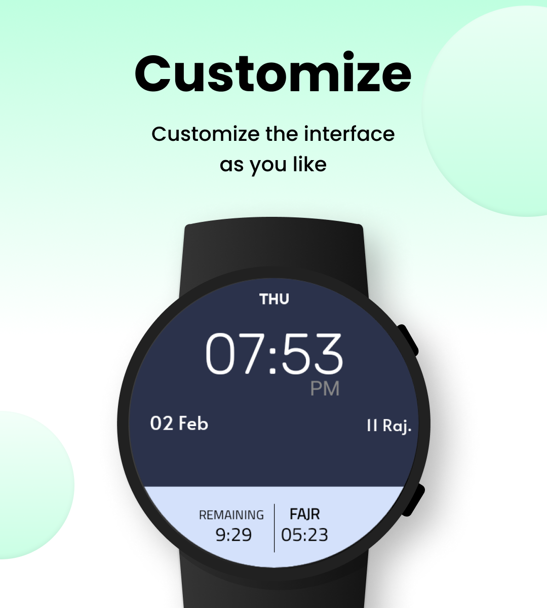
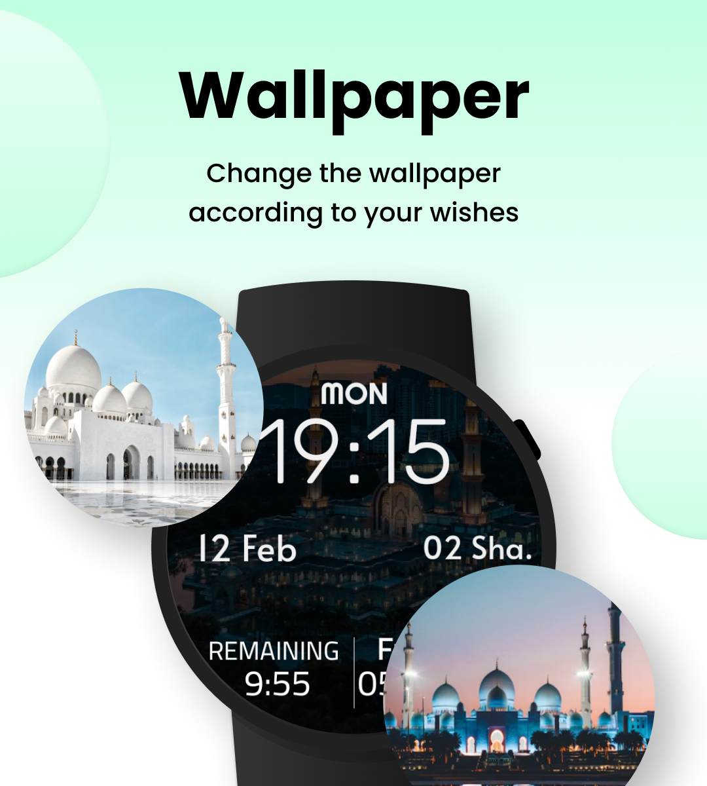
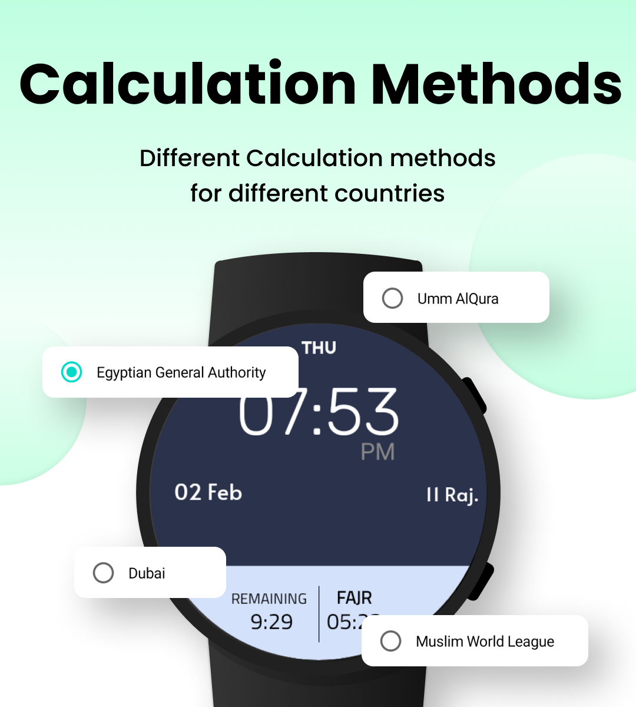

# Prayer Watch Face - Prayer Times on your Watch


A Watch Face for WearOS that shows the upcoming Prayer time, time left for upcoming Prayer and Hijri
Date. NOTE: You have to open the App after installing to Configure the settings. You can add the
Watch Face either using the Companion app on your phone or using your watch.

<a href='https://play.google.com/store/apps/details?id=com.devlomi.prayerwatchface&pcampaignid=pcampaignidMKT-Other-global-all-co-prtnr-py-PartBadge-Mar2515-1'></a>

## Screenshots

<p float="left">
   
  
  
  
  
</p>

## TODOs

1. Support API 21+ on Mobile
2. ~~Add Hijri Offset~~
3. Add Analog watch face
4. Add Walkthrough Tutorial on how to add a Watch Face
5. ~~Add Manual Prayer times adjustments~~
6. Check for Google Play Services On Mobile.
7. ~~Add Arabic Support to the Watch Face~~
8. ~~Add Elapsed Time after the Prayer~~
9. ~~Notifications for Prayers~~
10. ~~Add support for Arabic & Turkish Languages~~

## Author

AbdulAlim Rajjoub

## License

```
   Copyright 2022 AbdulAlim Rajjoub

   Licensed under the Apache License, Version 2.0 (the "License");
   you may not use this file except in compliance with the License.
   You may obtain a copy of the License at

       http://www.apache.org/licenses/LICENSE-2.0

   Unless required by applicable law or agreed to in writing, software
   distributed under the License is distributed on an "AS IS" BASIS,
   WITHOUT WARRANTIES OR CONDITIONS OF ANY KIND, either express or implied.
   See the License for the specific language governing permissions and
   limitations under the License.
```